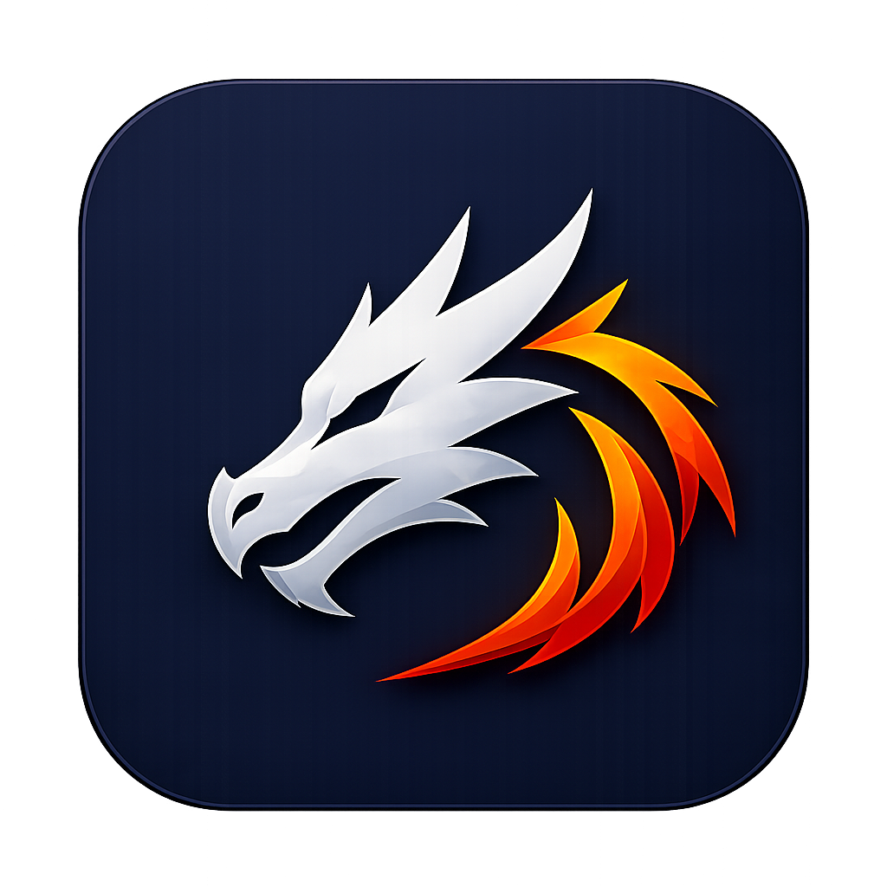
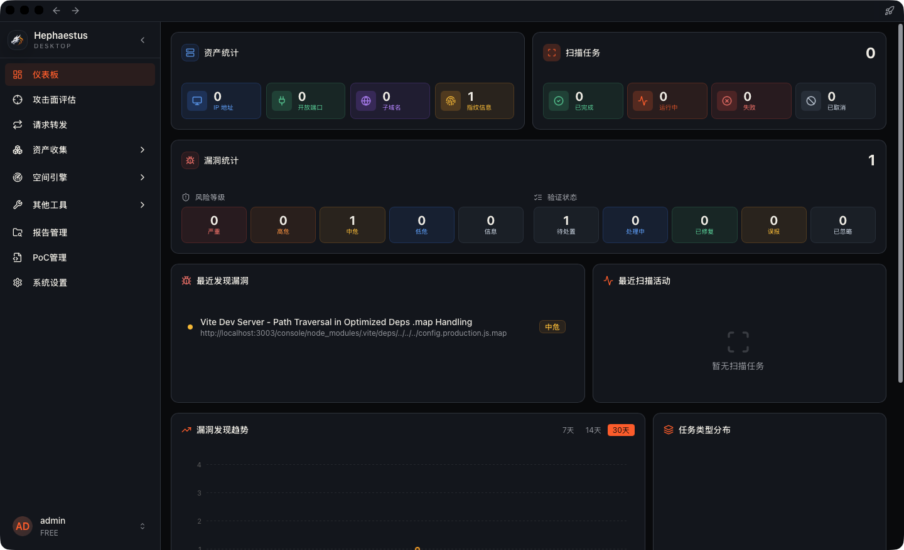

<h1 align="center">Hephaestus Desktop Client</h1>

  <a href="https://github.com/qiwentaidi/Hephaestus-Desktop/blob/main/README.md">中文</a> •
  <a href="https://github.com/qiwentaidi/Hephaestus-Desktop/blob/main/README_EN.md">English</a>

 

This project is the v3 release of [Slack](https://github.com/qiwentaidi/Slack).

Compared with v2, the focus of the v3 upgrade is not just a higher vulnerability count. It is a broader enhancement across scanning capability, result management, and real-world usability: a brand-new scanning strategy, global report management, more complete request forwarding, and vulnerability coverage expanded from 3400+ to 4900+.

## Quick Start

- Official signup: [http://47.97.59.120](http://47.97.59.120)
- Web version: https://github.com/qiwentaidi/Hephaestus
- After registering and obtaining a key, you can use both the desktop client and the web version

## Core Upgrades

The current version mainly strengthens the following areas:

- Scanning capability: a brand-new port identification and filtering strategy, improved JS vulnerability detection and attack-chain analysis, and continued maintenance of the latest Nuclei templates
- Result management: supports global report management, a more complete dashboard view, and stronger data retention
- Request forwarding: upgraded from basic capability to cover common real-world usage scenarios, making integrations more practical
- Vulnerability coverage: increased from 3400+ to 4900+
- Collaborative usage: the web version and desktop client can share data sources for coordinated use

## Screenshots

## Contact

Please include a short note about your purpose when adding me.

